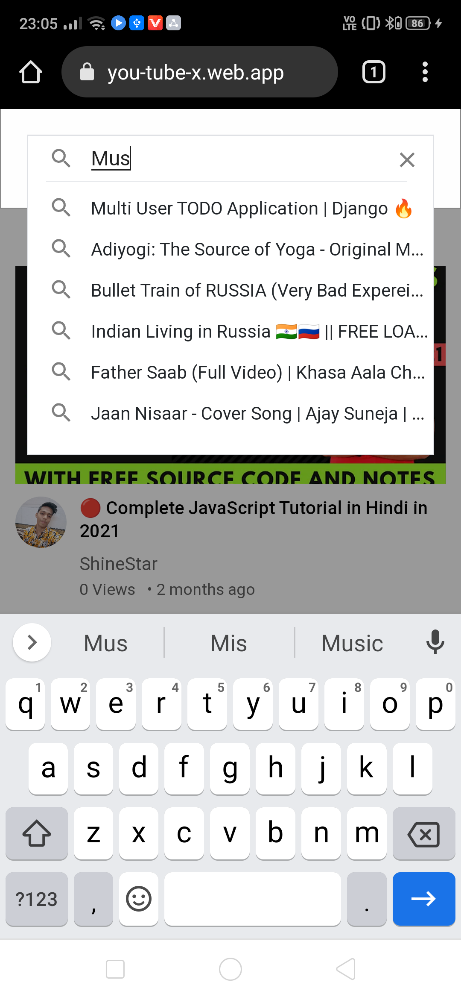
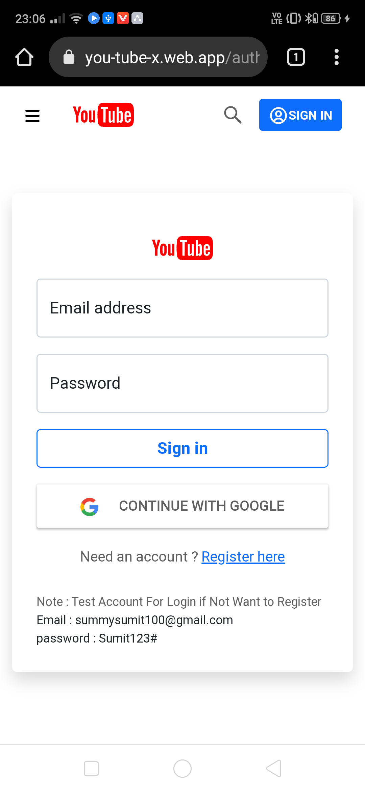
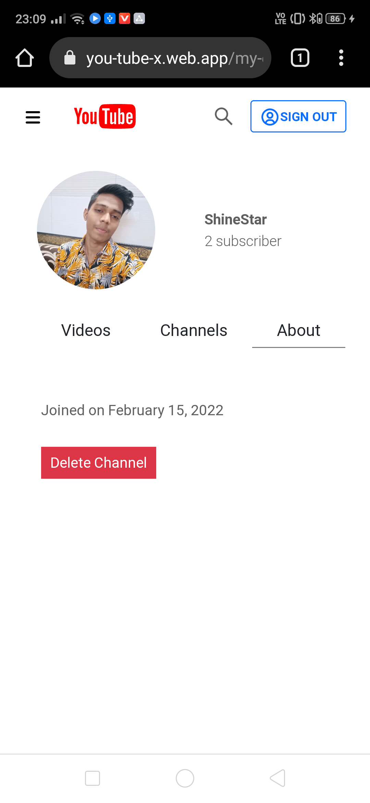
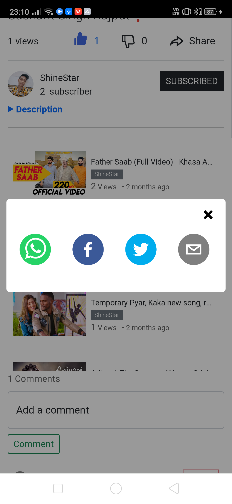

# Youtube-X ( https://you-tube-x.web.app )

( React JS + Django Rest Framework )

  
  
  
 

  
  
  
 

Simply clone backend and frontend repositories 
Run command npm install to install dependencies

# Enjoy 🥳🥳🥳🥳
