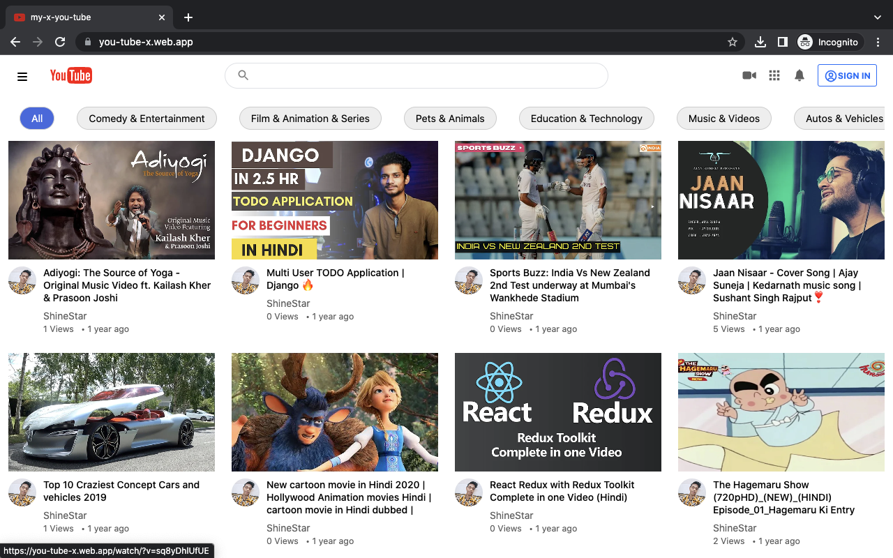
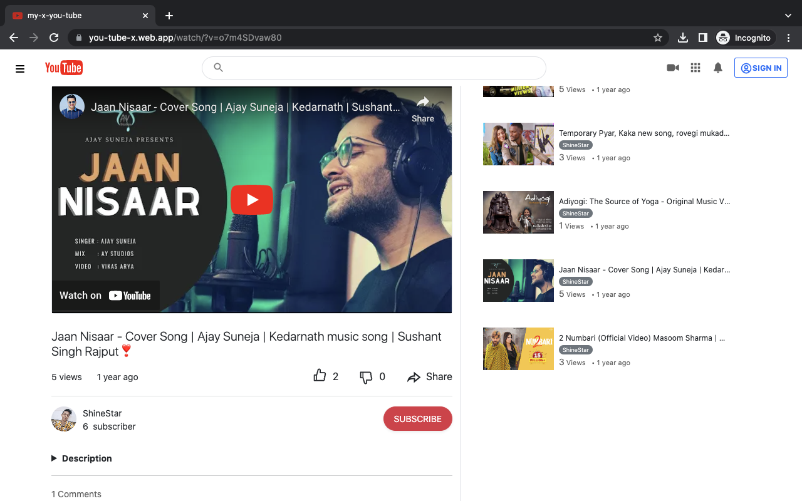
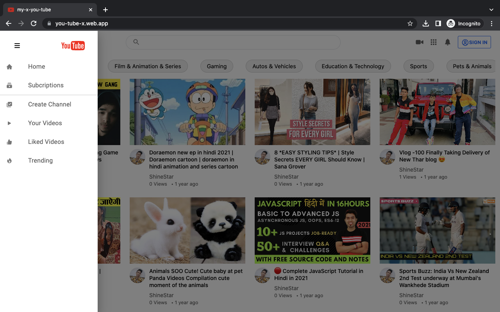
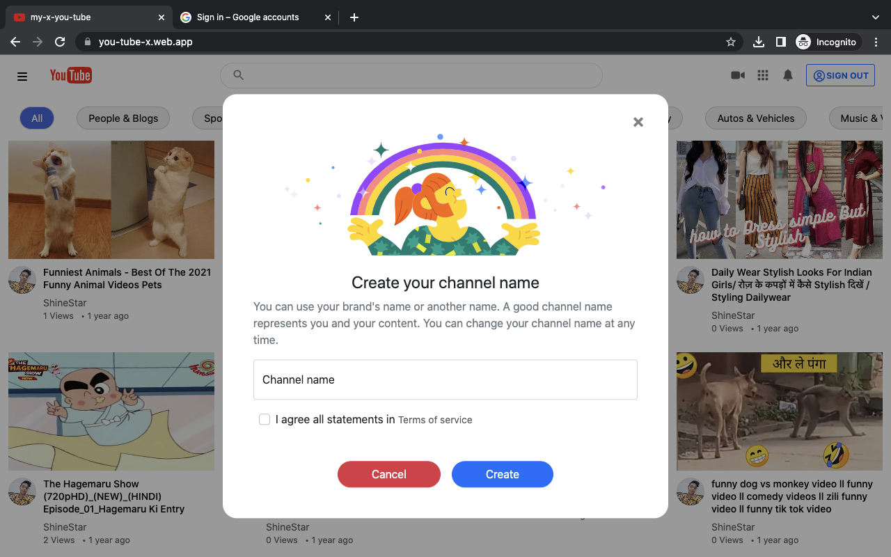
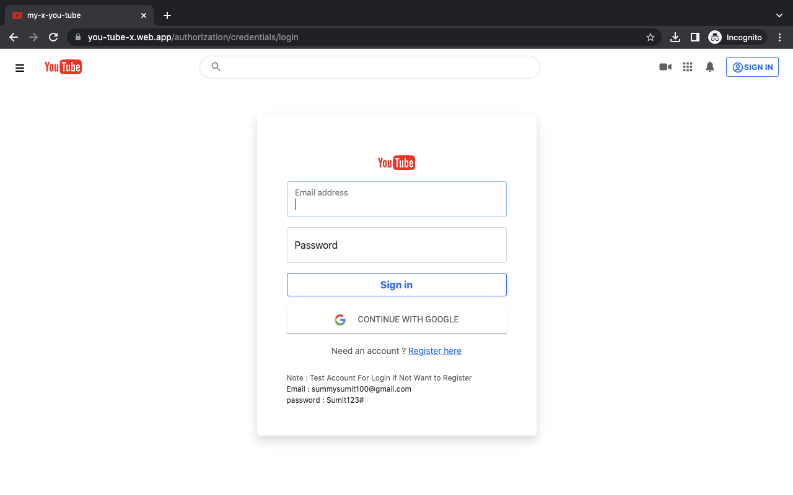

# YouTube Clone - https://you-tube-x.web.app

This is a YouTube clone web application that includes authentication, login, signup, video uploading, likes, dislikes, subscriptions, comments, and view counts.

## Table of Contents

- [Demo](#demo)
- [Features](#features)
- [Technologies Used](#technologies-used)
- [Setup](#setup)
- [Usage](#usage)
- [Contributing](#contributing)
- [License](#license)

## Demo

You can see a live demo of the application [here](https://you-tube-x.web.app).

## Features

- User authentication: Users can sign up and log in to the application.
- Video uploading: Users can upload videos to the platform.
- Like and dislike: Users can like or dislike videos.
- Subscriptions: Users can subscribe to other channels.
- Comments: Users can leave comments on videos.
- View counts: The number of views for each video is tracked.

## Technologies Used

- Front-end: React.js, JavaScript, HTML, CSS
- Back-end: Python, Django
- Database: SQLite3
- Backend Hosting: PythonAnywhere
- Frontend Hosting: Firebase

## Setup

1. Clone the repository:
    ```bash
    git clone https://github.com/sumit-singh1196/my-youtube.git

2. Clone the repository:
    ```bash
    npm install

## Usage
1. Start the React development server:
    ```bash
    npm start

2. Open your browser and navigate to http://localhost:3000 to access the application.
3. For the backend, you need to set up a local development environment with Python and Django. Follow these steps:
   - Install Python (version X.X.X) from Python.org.
   - Install Django (version X.X.X) using pip:
      ```base
      pip install django
   - Configure the Django settings to connect to your local SQLite3 database and PythonAnywhere backend endpoints.
4. Run the Django development server:
    ```base
      python manage.py runserver
5. Open your browser and navigate to http://localhost:8000 to access the backend.


## Screenshots
Here are a few screenshots of the Video Call App:








## Contributing
Contributions are welcome! If you would like to contribute to this project, please follow these steps:
1. Fork the repository.
2. Create a new branch for your feature or bug fix.
3. Make the necessary changes in your branch.
4. Commit your changes and push your branch to your forked repository.
5. Submit a pull request describing your changes.

## License
- This project is licensed under the MIT License.
- Feel free to modify and customize the above README template according to your project's specific requirements.
